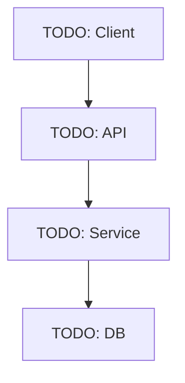

# Architecture Map

Карта системы для агентов — что где живёт и как связано.
Обновляй при добавлении новых модулей или изменении границ.

---

## System overview

```
TODO: нарисуй диаграмму системы (ASCII или Mermaid)
```



## Modules

| Модуль | Путь | Ответственность | Агент не трогает без плана |
|--------|------|----------------|--------------------------|
| TODO   | TODO | TODO           | TODO                     |

## Data flows

> Опиши основные потоки данных: откуда приходят, куда уходят, что трансформируется.

## External dependencies

| Сервис | Назначение | Критичность |
|--------|-----------|------------|
| TODO   | TODO      | TODO       |

## Known tech debt

| Проблема | Где | Приоритет | Когда трогать |
|----------|-----|-----------|--------------|
| TODO     | TODO| TODO      | TODO         |

## Zones agents must not touch

> Список файлов / модулей / директорий, которые агенты не должны изменять без явного ТЗ.

- `TODO`
